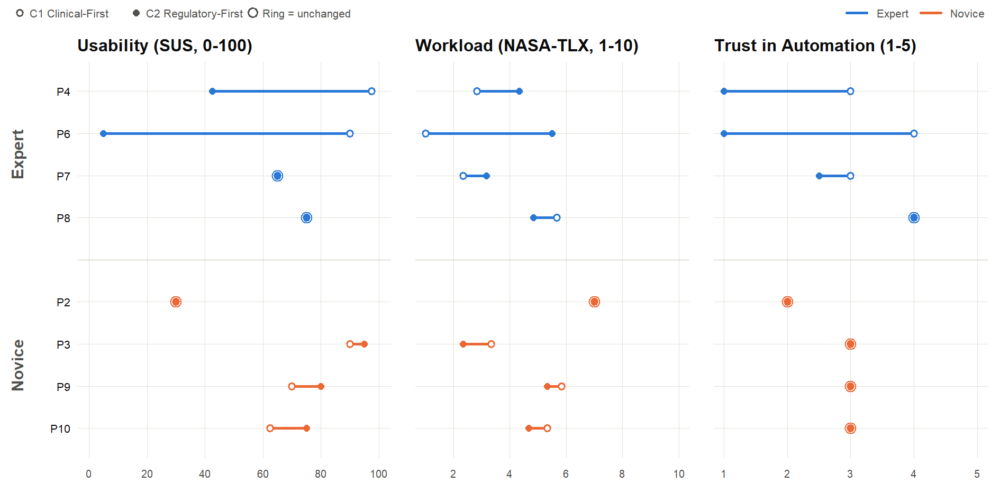
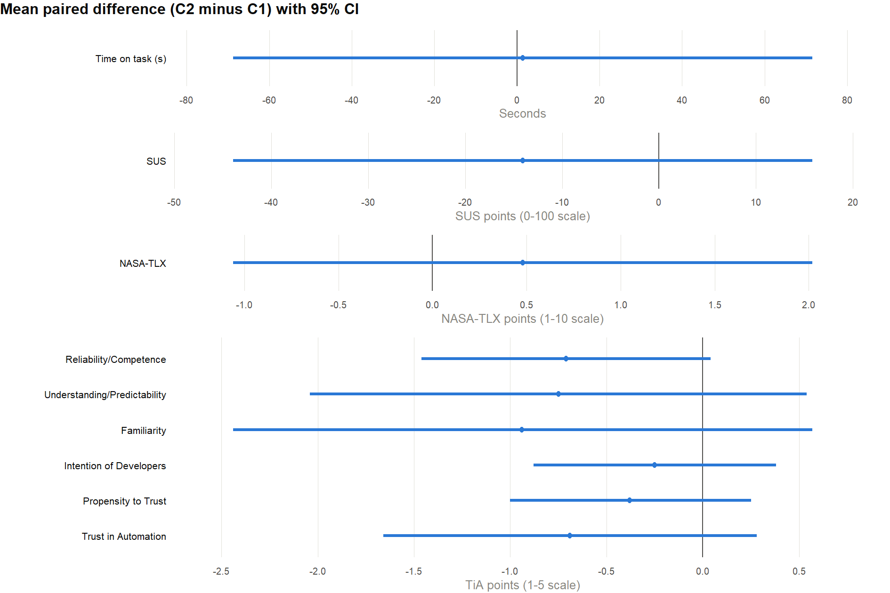
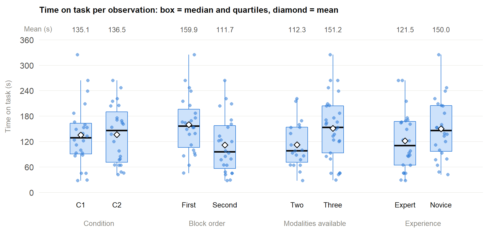
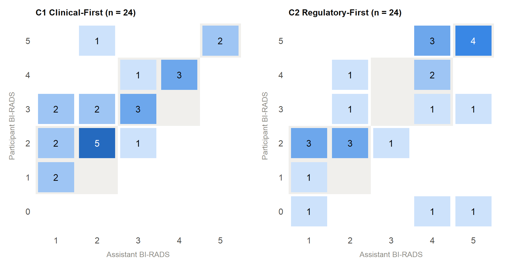

# MIMBCD-UI UTA21 Evaluation Metrics & Psychometrics Analysis

**Notes**
- **C1 = Clinical-First** (the assistant presents a BI-RADS category); **C2 = Regulatory-First** (it presents a suspicion level derived from the same category).
- Paired differences are **C2 minus C1** (negative = lower under the suspicion level).
- Suspicion levels: Low = {1, 2}, Moderate = {3, 4}, High = {5}. The mapping was not shown to participants.
- A final assessment of BI-RADS 0 falls within no level; band agreement is reported both excluding such responses and counting them as departures.
- Block order is taken from the row order in the case file (a participant's first three rows are their first block).
- Scoring: SUS in the standard way (0-100). Adapted NASA-TLX: six items on 1-10, unweighted, the performance item reverse-scored (11 - x), composite = mean of the six. TiA: Koerber's key, items 5, 7, 10, 15 and 16 reverse-scored (6 - x), each subscale = mean of its items.
- Wilcoxon signed-rank test: zero differences dropped, tied differences given average ranks, exact two-sided p from all 2^k sign assignments.

## Data
- `data/mimbcdui_uta21_case_data.csv`: one row per observation (48). Columns: `scenario_id`, `participant_id`, `category_level`, `expertise_level`, `condition` (1 = C1, 2 = C2), `case_id`, `time_on_task` (h:mm:ss), `birads_assistant`, `birads_radiologist`, `action` (`accept`, `edit->accept`, `reject`). In C2, `birads_radiologist` may also record the level the participant selected, e.g. `4 (H)`; only the number is used for agreement. Time on task, the final BI-RADS and the action were coded from the session screen recordings.
- `data/mimbcdui_uta21_questionnaire_answers.csv`: one row per participant and condition (16), with the SUS (items 1-10), NASA-TLX (items 11-16) and TiA (items 17-35) answers in the order administered.
- `data/case_provenance.csv`: the source of each case in the UTA11 rates and DICOM datasets (patient identifier, BI-RADS field used, dataset commits).

Participants are identified only by code (P2-P4, P6-P10).

## Visualizations

### Questionnaires per Participant (SUS, NASA-TLX, Trust in Automation)


### Paired Differences with 95% CI


### Time on Task


### Assistant vs Participant BI-RADS


## Statistical Results

### Sample and Allocation
- **Participants:** 8 (Experts: P4, P6, P7, P8; Novices: P2, P3, P9, P10)
- **Observations:** 48 (3 per participant per condition)
- **Repeated observations:** 10, all in the participant's second block (P2: c02, c07; P3: c01, c06; P4: c04; P6: c03; P7: c05; P8: c01; P9: c02; P10: c03)
- **Began with C1:** 5 (P2, P3, P6, P7, P9). **Began with C2:** 3 (P4, P8, P10)
- **Order by group:** Novices 3 of 4 began with C1; Experts 2 of 4
- **Case mix, C1:** Low = 14, Moderate = 8, High = 2
- **Case mix, C2:** Low = 10, Moderate = 8, High = 6
- **Observations on cases with all three modalities:** C1 = 15, C2 = 14

### SUS
- **C1:** M = 72.50
- **C2:** M = 58.44
- **Paired difference:** M = -14.06, 95% CI [-43.95, 15.83]
- **Wilcoxon:** W = 6.0, p = 0.812
- **Effect sizes:** d_z = -0.39, r_rb = -0.20
- **Direction:** 2 decreased, 3 increased, 3 unchanged
- **Experts (n=4):** M = 81.88 → 46.88
- **Novices (n=4):** M = 63.12 → 70.00
- **Excluding P6:** M diff = -3.93

### NASA-TLX (adapted, 1-10)
- **C1:** M = 4.17
- **C2:** M = 4.65
- **Paired difference:** M = 0.48, 95% CI [-1.06, 2.02]
- **Wilcoxon:** W = 11.5, p = 0.734
- **Effect sizes:** d_z = 0.26, r_rb = 0.18
- **Direction:** 4 decreased, 3 increased, 1 unchanged
- **Experts (n=4):** M = 2.96 → 4.46
- **Novices (n=4):** M = 5.38 → 4.83
- **Excluding P6:** M diff = -0.10

### TiA_Reliability/Competence
- **C1:** M = 3.21
- **C2:** M = 2.50
- **Paired difference:** M = -0.71, 95% CI [-1.46, 0.04]
- **Wilcoxon:** W = 0.0, p = 0.016
- **Effect sizes:** d_z = -0.79, r_rb = -1.00
- **Direction:** 7 decreased, 0 increased, 1 unchanged
- **Experts (n=4):** M = 3.42 → 2.25
- **Novices (n=4):** M = 3.00 → 2.75
- **Excluding P6:** M diff = -0.45

### TiA_Understanding/Predictability
- **C1:** M = 3.59
- **C2:** M = 2.84
- **Paired difference:** M = -0.75, 95% CI [-2.04, 0.54]
- **Wilcoxon:** W = 11.5, p = 0.414
- **Effect sizes:** d_z = -0.49, r_rb = -0.36
- **Direction:** 5 decreased, 3 increased, 0 unchanged
- **Experts (n=4):** M = 4.00 → 2.56
- **Novices (n=4):** M = 3.19 → 3.12
- **Excluding P6:** M diff = -0.43

### TiA_Familiarity
- **C1:** M = 3.88
- **C2:** M = 2.94
- **Paired difference:** M = -0.94, 95% CI [-2.44, 0.57]
- **Wilcoxon:** W = 3.0, p = 0.312
- **Effect sizes:** d_z = -0.52, r_rb = -0.60
- **Direction:** 4 decreased, 1 increased, 3 unchanged
- **Experts (n=4):** M = 4.25 → 2.25
- **Novices (n=4):** M = 3.50 → 3.62
- **Excluding P6:** M diff = -0.50

### TiA_Intention of Developers
- **C1:** M = 3.81
- **C2:** M = 3.56
- **Paired difference:** M = -0.25, 95% CI [-0.88, 0.38]
- **Wilcoxon:** W = 1.5, p = 0.750
- **Effect sizes:** d_z = -0.33, r_rb = -0.50
- **Direction:** 2 decreased, 1 increased, 5 unchanged
- **Experts (n=4):** M = 4.25 → 3.88
- **Novices (n=4):** M = 3.38 → 3.25
- **Excluding P6:** M diff = 0.00

### TiA_Propensity to Trust
- **C1:** M = 3.00
- **C2:** M = 2.62
- **Paired difference:** M = -0.38, 95% CI [-1.00, 0.25]
- **Wilcoxon:** W = 0.0, p = 0.500
- **Effect sizes:** d_z = -0.50, r_rb = -1.00
- **Direction:** 2 decreased, 0 increased, 6 unchanged
- **Experts (n=4):** M = 3.42 → 2.92
- **Novices (n=4):** M = 2.58 → 2.33
- **Excluding P6:** M diff = -0.14

### TiA_Trust in Automation
- **C1:** M = 3.12
- **C2:** M = 2.44
- **Paired difference:** M = -0.69, 95% CI [-1.66, 0.28]
- **Wilcoxon:** W = 0.0, p = 0.250
- **Effect sizes:** d_z = -0.59, r_rb = -1.00
- **Direction:** 3 decreased, 0 increased, 5 unchanged
- **Experts (n=4):** M = 3.50 → 2.12
- **Novices (n=4):** M = 2.75 → 2.75
- **Excluding P6:** M diff = -0.36

### Paired Differences by Condition Completed First
- **Began with C1 (n=5):** SUS = -14.00, NASA-TLX = 0.77, Trust in Automation = -0.70
- **Began with C2 (n=3):** SUS = -14.17, NASA-TLX = 0.00, Trust in Automation = -0.67
- **All (n=8):** SUS = -14.06, NASA-TLX = 0.48, Trust in Automation = -0.69

### Per-Participant Paired Differences (C2 minus C1)

| Group | Participant | SUS | NASA-TLX | Reliability/ Competence | Understanding/ Predictability | Familiarity | Intention of Developers | Propensity to Trust | Trust in Automation |
|---|---|---:|---:|---:|---:|---:|---:|---:|---:|
| Expert | P4 | -55.0 | 1.50 | -1.67 | -3.25 | -3.50 | 0.00 | 0.00 | -2.00 |
| Expert | P6 | -85.0 | 4.50 | -2.50 | -3.00 | -4.00 | -2.00 | -2.00 | -3.00 |
| Expert | P7 | 0.0 | 0.83 | 0.00 | 0.75 | -0.50 | 0.50 | 0.00 | -0.50 |
| Expert | P8 | 0.0 | -0.83 | -0.50 | -0.25 | 0.00 | 0.00 | 0.00 | 0.00 |
| Novice | P2 | 0.0 | 0.00 | -0.17 | -0.75 | 0.00 | 0.00 | 0.00 | 0.00 |
| Novice | P3 | 5.0 | -1.00 | -0.50 | -0.25 | 0.00 | -0.50 | 0.00 | 0.00 |
| Novice | P9 | 10.0 | -0.50 | -0.17 | 0.50 | 1.00 | 0.00 | 0.00 | 0.00 |
| Novice | P10 | 12.5 | -0.67 | -0.17 | 0.25 | -0.50 | 0.00 | -1.00 | 0.00 |

### Time on Task (seconds)
- **C1 (n=24):** M = 135.1, Mdn = 128.5, SD = 73.2
- **C2 (n=24):** M = 136.5, Mdn = 145.5, SD = 68.6
- **Paired difference (participant means):** M = 1.42, 95% CI [-68.76, 71.59]
- **Wilcoxon:** W = 16.0, p = 0.844
- **Effect sizes:** d_z = 0.02, r_rb = 0.11
- **First block (n=24):** M = 159.9, Mdn = 156.5, SD = 66.7
- **Second block (n=24):** M = 111.7, Mdn = 95.5, SD = 66.4
- **By block and condition (mean):** first block C1 = 160.9, C2 = 158.1; second block C1 = 92.0, C2 = 123.5
- **Two modalities (n=19):** M = 112.3, Mdn = 98.0, SD = 54.4
- **Three modalities (n=29):** M = 151.2, Mdn = 153.0, SD = 75.8
- **Experts (n=24):** M = 121.5, Mdn = 110.0, SD = 69.0 (C1 = 103.2, C2 = 139.8)
- **Novices (n=24):** M = 150.0, Mdn = 146.0, SD = 69.9 (C1 = 166.9, C2 = 133.2)

### Concordance with the Assistant
- **Band agreement, C1:** 18/24 (75.0%)
- **Band agreement, C2:** 14/21 (66.7%) excluding BI-RADS 0; 14/24 (58.3%) counting BI-RADS 0 as departures
- **Exact agreement, C1:** 15/24 (62.5%)
- **Exact agreement, C2:** 10/24 (41.7%); 10/21 (47.6%) excluding BI-RADS 0
- **Excluding repeats, band:** C1 = 15/21 (71.4%); C2 = 9/14 (64.3%), 9/17 (52.9%) counting BI-RADS 0
- **Direction of departures (excluding BI-RADS 0):** C1 = 8 up, 1 down; C2 = 8 up, 3 down

### Concordance by Experience Group
- **Experts, band:** C1 = 10/12 (83.3%); C2 = 5/9 (55.6%), 5/12 (41.7%) counting BI-RADS 0
- **Experts, exact:** C1 = 8/12 (66.7%); C2 = 3/12 (25.0%), 3/9 (33.3%) excluding BI-RADS 0
- **Novices, band:** C1 = 8/12 (66.7%); C2 = 9/12 (75.0%)
- **Novices, exact:** C1 = 7/12 (58.3%); C2 = 7/12 (58.3%)
- **Exact agreement per participant (C1 → C2):** P4 1.00 → 0.00, P6 0.33 → 0.33, P7 1.00 → 0.33, P8 0.33 → 0.33, P2 0.33 → 0.33, P3 0.00 → 0.33, P9 1.00 → 1.00, P10 1.00 → 0.67

### Concordance by Suspicion Level
| Level | Exact C1 | Exact C2 | Band C1 | Band C2 (excl. 0) | Band C2 excl. repeats |
|---|---:|---:|---:|---:|---:|
| Low | 7/14 (0.50) | 4/10 (0.40) | 9/14 (0.64) | 7/9 (0.78) | 2/4 (0.50) |
| Moderate | 6/8 (0.75) | 2/8 (0.25) | 7/8 (0.88) | 3/7 (0.43) | 3/5 (0.60) |
| High | 2/2 (1.00) | 4/6 (0.67) | 2/2 (1.00) | 4/5 (0.80) | 4/5 (0.80) |

- **Band C1 excluding repeats:** Low = 6/11 (0.55), Moderate = 7/8 (0.88), High = 2/2 (1.00)
- **Moderate, counting BI-RADS 0 as departure:** C2 = 3/8 (0.38)

### Moderate Cases (band agreement, excluding BI-RADS 0)
| Case | Assistant BI-RADS | C1 | C2 |
|---|---:|---:|---:|
| c06 | 3 | 4/5 | 0/1* |
| c07 | 4 | 1/1 | 1/3* |
| c08 | 4 | 2/2 | 2/3 |

\* Contains a repeated observation (c06: P3; c07: P2, which did not agree).

### BI-RADS 0 Responses
- **P4 (expert), C2, c02:** assistant BI-RADS 1 (Low), two modalities
- **P4 (expert), C2, c07:** assistant BI-RADS 4 (Moderate), two modalities
- **P7 (expert), C2, c10:** assistant BI-RADS 5 (High), three modalities

### Actions on the Suggestion
| Condition | Accept | Edit, then accept | Reject |
|---|---:|---:|---:|
| C1 | 15 | 5 | 4 |
| C2 | 12 | 2 | 10 |

- **Experts:** C1 = 8 accept, 1 edit, 3 reject; C2 = 4 accept, 0 edit, 8 reject
- **Novices:** C1 = 7 accept, 4 edit, 1 reject; C2 = 8 accept, 2 edit, 2 reject
- **Excluding repeated observations:** C1 = 13 / 5 / 3 (n=21); C2 = 8 / 1 / 8 (n=17)
- **Excluding P6:** C1 = 14 / 4 / 3 (n=21); C2 = 12 / 2 / 7 (n=21)
- **Rejections per participant (C1 → C2):** P4 0 → 2, P6 1 → 3, P7 0 → 2, P8 2 → 1, P2 1 → 1, P3 0 → 0, P9 0 → 0, P10 0 → 1

| Level | C1 accept / edit / reject | C2 accept / edit / reject |
|---|---:|---:|
| Low | 7 / 4 / 3 | 7 / 0 / 3 |
| Moderate | 6 / 1 / 1 | 1 / 2 / 5 |
| High | 2 / 0 / 0 | 4 / 0 / 2 |

- **Final category different from the assistant's (excluding BI-RADS 0):** C1 = 0 accept, 5 edit, 4 reject; C2 = 4 accept, 1 edit, 6 reject
- **BI-RADS 0 responses:** all 3 recorded as rejections (C2)
- **C2 rejections with the final category inside the level presented:** P6 c03 (2 → 2), P6 c08 (4 → 3)
- **C2 acceptances with the final category outside the level presented:** P4 c04 (2 → 3)
- **Selected level differing from the mapping of the recorded category:** P3 c08 (category 4, level H, edit then accept); P4 c04 (category 3, level L, accept)

## Reproducing

```bash
Rscript src/uta21_analysis.R data/mimbcdui_uta21_case_data.csv data/mimbcdui_uta21_questionnaire_answers.csv output uta21_analysis_results.txt
```

Base R only; no packages required. All four arguments are optional and default to the values shown (case data, questionnaire answers, output folder, results file), resolved from the working directory. The script prints every value above and also saves that printout, headed by the run date, the R version and the input files, to `output/uta21_analysis_results.txt`. It writes the four figures to `output/` as PNG. The results in `output/` were produced with R 4.5.1.